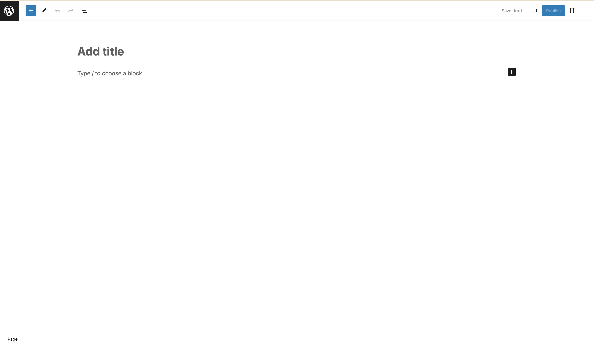
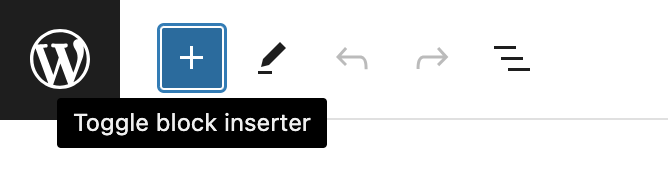
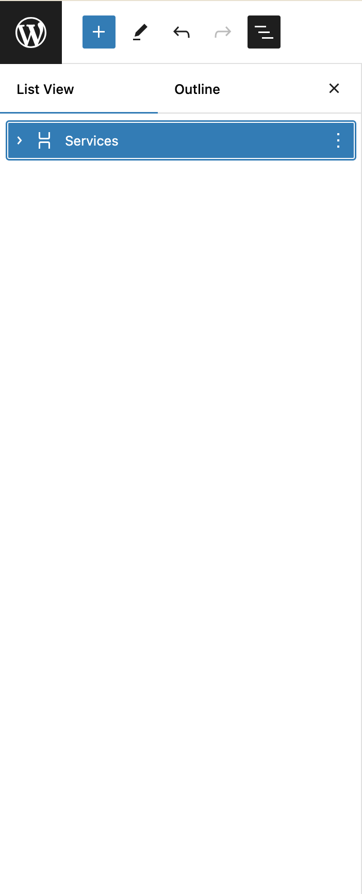
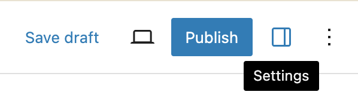
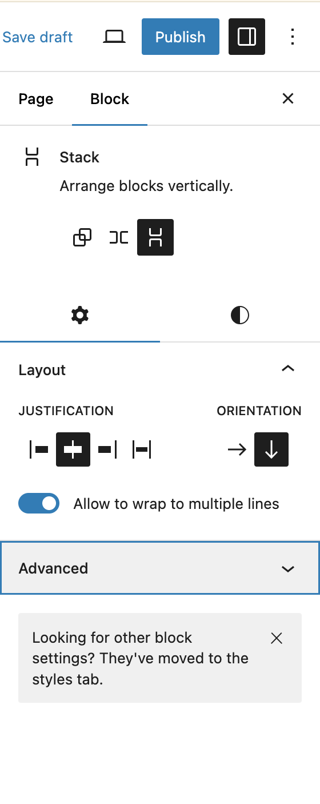
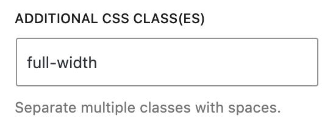

<p align="center">
  <a href="https://roots.io/bedrock/">
    
  </a>
</p>

<p align="center">
  <a href="https://packagist.org/packages/roots/bedrock">
    
  </a>

  <a href="https://packagist.org/packages/roots/wordpress">
    
  </a>
  
  

  <a href="https://github.com/roots/bedrock/actions/workflows/ci.yml">
    
  </a>

  <a href="https://twitter.com/rootswp">
    
  </a>
</p>

<p align="center">WordPress boilerplate with Composer, easier configuration, and an improved folder structure</p>

<p align="center">
  <a href="https://roots.io/bedrock/">Website</a> &nbsp;&nbsp; <a href="https://roots.io/bedrock/docs/installation/">Documentation</a> &nbsp;&nbsp; <a href="https://github.com/roots/bedrock/releases">Releases</a> &nbsp;&nbsp; <a href="https://discourse.roots.io/">Community</a>
</p>

## Sponsors

Bedrock is an open source project and completely free to use. If you've benefited from our projects and would like to support our future endeavors, please consider [sponsoring Roots](https://github.com/sponsors/roots).

<div align="center">
<a href="https://k-m.com/"></a> <a href="https://carrot.com/"></a> <a href="https://wordpress.com/"></a> <a href="https://worksitesafety.ca/careers/"></a> <a href="https://www.itineris.co.uk/"></a>
</div>

## Overview

Bedrock is a WordPress boilerplate for developers that want to manage their projects with Git and Composer. Much of the philosophy behind Bedrock is inspired by the [Twelve-Factor App](http://12factor.net/) methodology, including the [WordPress specific version](https://roots.io/twelve-factor-wordpress/).

- Better folder structure
- Dependency management with [Composer](https://getcomposer.org)
- Easy WordPress configuration with environment specific files
- Environment variables with [Dotenv](https://github.com/vlucas/phpdotenv)
- Autoloader for mu-plugins (use regular plugins as mu-plugins)
- Enhanced security (separated web root and secure passwords with [wp-password-bcrypt](https://github.com/roots/wp-password-bcrypt))

## Requirements
- PHP >= 8.0
- [Composer](https://getcomposer.org/doc/00-intro.md#installation-linux-unix-macos)
- [Yarn](https://yarnpkg.com/)
- NodeJS >= 20.
- [WP-CLI](https://wp-cli.org/)

### Sage Package Compatibilty Setup
#### Windows users. 
> WSL is required in order to use Sage. Build commands must be ran from a [WSL environment](https://docs.microsoft.com/en-us/windows/wsl/).

Sage relies on Node.js based tools to manage dependencies and build assets. We recommend using [Volta](https://github.com/volta-cli/volta) to install and manage Node.js. We also recommend using [Yarn](https://yarnpkg.com/). [After installing Volta](https://docs.volta.sh/guide/getting-started):

```bash
# Install the latest Node.js LTS release
$ volta install node

# Globally install Yarn
$ npm install --global yarn
```
> Make sure you installed all the requirements above before proceed to "Getting Started" instructions...

## Package Installed
1. Main
    ```
    "php": ">=8.0",
    "roots/bedrock"
    ```
1. Sage Theme `Flexor`
    ```
    --- Server
    "php": ">=8.0",
    "log1x/poet": "^2.1",
    "log1x/sage-directives": "^2.0",
    "roots/acorn": "^4.2"
    "@roots/sage": "6.20.0",
    "@roots/bud-sass": "^6.21.0",
    "@roots/bud": "6.20.0",
    --- Client (Flexor Theme)
    "@popperjs/core": "^2.11.8",
    "aos": "^2.3.4",
    "bootstrap": "^5.3.3",
    "bootstrap-icons": "^1.11.3",
    "glightbox": "^3.3.0",
    "imagesloaded": "^5.0.0",
    "isotope-layout": "^3.0.6",
    "swiper": "^11.1.4"
    "@10up/block-components": "^1.18.2",
    ```

## Getting Started (Local Development)

1. Clone this github using this command:
```bash
git clone https://github.com/idbsupport3F/portalv6.git
```

2. Make sure you have composer [install here](https://getcomposer.org/doc/00-intro.md#installation-linux-unix-macos)

3. Then, you need to create new `.env` file to store all the server/database info here. Then copy all the codes from `.env.example` to your new created `.env` file and adjust your server/database data in it. For more info, you can refer [Bedrock documentation here](https://roots.io/bedrock/docs/installation/#getting-started).
> P/s: Make sure in your own public/private repo, this `.env` file won't be able to view by any parties. It should be hold secretly in server using superadmin access.

4. Update `bud.config.js` with your local dev URL in `web/app/themes/flexor/bud.config.js`

5. At root directory, run composer like this:
    ```bash
    composer install
    ```

6. Then go to sage theme directoy, run this:
    ```bash
    # Go to flexor directory
    cd /web/app/themes/flexor

    # Install Composer
    composer install

    # If the above installation outputs error to tell you to run `composer update`. Run `composer update`.
    ```
    <details>
      <summary>Don't have command for <code>yarn</code>?</summary>
      Visit this <a href='https://classic.yarnpkg.com/lang/en/docs/install/#mac-stable'>yarn installation link</a> to install yarn cli in your system
    </details>

7. To Compile assets, run this command in your root folder `idbkl`:
    ```bash
    # Build Asset
    composer run-script build-theme

    # Build Asset as development (Hot Reload)
    composer run-script dev-theme
    ```
8. Before start the server, [Configure your server from this setup (Apache/Nginx)](https://roots.io/bedrock/docs/server-configuration/). If you wish to configure Apache using `.htaccess`, you may put the file inside `/web` directory. Example apache server config in `/web/.htaccess` :
    ```
    <FilesMatch ".+\.(blade\.php)$">
      # Apache 2.4
      <IfModule mod_authz_core.c>
          Require all denied
      </IfModule>

      # Apache 2.2
      <IfModule !mod_authz_core.c>
          Order deny,allow
          Deny from all
      </IfModule>
    </FilesMatch>
    # BEGIN WordPress
    <IfModule mod_rewrite.c>
      RewriteEngine On
      RewriteBase /
      RewriteRule ^index.php$ - [L]
      RewriteCond %{REQUEST_FILENAME} !-f
      RewriteCond %{REQUEST_FILENAME} !-d
      RewriteRule . /index.php [L]
    </IfModule>
    # END WordPress
    ```

## Getting Started (Production)

1. Clone this github using this command:
```bash
git clone https://github.com/idbsupport3F/portalv6.git
```

2. Make sure you have composer [install here](https://getcomposer.org/doc/00-intro.md#installation-linux-unix-macos)

3. Then, you need to create new `.env` file to store all the server/database info here. Then copy all the codes from `.env.example` to your new created `.env` file and adjust your server/database data in it. For more info, you can refer [Bedrock documentation here](https://roots.io/bedrock/docs/installation/#getting-started).
> P/s: Make sure in your own public/private repo, this `.env` file won't be able to view by any parties. It should be hold secretly in server using superadmin access.

4. Update `bud.config.js` with your local dev URL in `web/app/themes/flexor/bud.config.js`

5. At root directory, run composer like this:
    ```bash
    composer run-script deploy
    ```
    <details>
      <summary>Don't have command for <code>yarn</code>?</summary>
      Visit this <a href='https://classic.yarnpkg.com/lang/en/docs/install/#mac-stable'>yarn installation link</a> to install yarn cli in your system
    </details>


## Development Tips
### Create custom blocks
> This tips is using this package named `poet` https://github.com/Log1x/poet

1. Make sure you have `poet.php` config file in `web/app/themes/your-theme/config/poet.php`. If not, run this command in your console:
    ```bash
    composer run-script vendor:publish
    # ^^^ Then choose "Log1x Poet PoetServiceProvider"
    ```

2. Add new config for `accordion` block in `poet.php` that was created earlier:
    ```php
    // ...
    'block' => [
        'sage/accordion' => [
            'attributes' => [
                'title' => [
                    'default' => 'Lorem ipsum',
                    'type' => 'string',
                ],
            ],
        ],
    ],
    // ...
    ```
> Blocks are registered using the `namespace/label` defined when [registering the block with the editor](https://developer.wordpress.org/block-editor/developers/block-api/block-registration/#registerblocktype). 

> If no namespace is provided, the current theme's [text domain](https://developer.wordpress.org/themes/functionality/internationalization/#loading-text-domain) will be used instead.

3. Create blocks file inside your theme folder in `resources/views/blocks/accordion.blade.php`.

4. Add this example code in `accordion.blade.php`:
    ```jinja
    <div class="wp-block-accordion">
      @isset ($data->title)
        <h2>{!! $data->title !!}</h2>
      @endisset
    </div>
    ```

5. Add this code to register your own block type inside `scripts` folder in `editor.js`:
    ```js
    /**
    * Accordian Block Register
    * 
    * @see {@link https://github.com/Log1x/poet/issues/22#issuecomment-792573232}
    */

    import { __ } from '@wordpress/i18n'
    import { registerBlockType } from '@wordpress/blocks'
    import { InnerBlocks } from '@wordpress/block-editor'

    /** components */
    import edit from './accordion/edit'

    registerBlockType(`sage/accordion`, {
        title: __(`Accordion`, `sage`),
        category: `flexor`,
        icon: `format-image`,
        edit
    })
    ```
    > Make sure that the first argument for `registerBlockType` must be `theme-name/block-name` format.
    <details>
      <summary>Why there is no <code>save</code> property?</summary>
      Due to this <a href="https://github.com/Log1x/poet">Poet package</a> that I installed, we already had our blade laravel view setup for the save renderer. No need to add it here...
    </details>
    <details>
      <summary>Where to find <code>icon</code> tags?</summary>
      Just visit this <a href="https://developer.wordpress.org/resource/dashicons/">page</a> that wordpress specifically used. It is called Dashicons.
    </details>

6. Since you added `edit.js` import file from your `editor.js` file above, we need to create a file based on that directory example in `resources/scripts/accordion/edit.js`. Then add this codes :
    ```js
    /**
    * Retrieves the translation of text.
    *
    * @see https://developer.wordpress.org/block-editor/reference-guides/packages/packages-i18n/
    */
    import { __ } from '@wordpress/i18n';

    /**
    * React hook that is used to mark the block wrapper element.
    * It provides all the necessary props like the class name.
    *
    * @see https://developer.wordpress.org/block-editor/reference-guides/packages/packages-block-editor/#useblockprops
    */
    import { useBlockProps } from '@wordpress/block-editor';

    /**
    * The edit function describes the structure of your block in the context of the
    * editor. This represents what the editor will render when the block is used.
    *
    * @see https://developer.wordpress.org/block-editor/reference-guides/block-api/block-edit-save/#edit
    *
    * @return {Element} Element to render.
    */
    export default function Edit(props) {

        const { attributes, setAttributes } = props;

        const { title } = attributes;

        return (
            <p {...useBlockProps()}>
                {__(
                    'Swiper Logo Slider – hello from the editor!',
                    'swiper-logo-slider'
                )}
            </p>
        );
    }
    ```
    > Use this guideline for your wordpress gutenberg editor react components for your uses in file `edit.js` above: https://wordpress.github.io/gutenberg/
    <details>
      <summary>Woah! Where to learn this format?</summary>
      Just visit this <a href="https://developer.wordpress.org/block-editor/reference-guides/block-api/block-edit-save/">page</a>. You also can learn attributes fetching from <a href="https://developer.wordpress.org/block-editor/reference-guides/block-api/block-attributes/#query-source">here</a>.
    </details>

7. When you finished, published the package and build the file from root folder.
    ```bash
    composer run-script vendor:publish
    # ^^^ Then choose "Log1x Poet PoetServiceProvider"

    #-----------------------------------------------

    # Finally Run Yarn
    composer run-script build-theme
    #or
    composer run-script build-dev
    ```

## Gutenberg Editor Tips
### AOS Animation
You can animate your container, text or even anything by just using class names! We use this [AOS plugin](https://michalsnik.github.io/aos/) for you to refer to.

<details>
  <summary>How to navigate to CSS Classes in Gutenberg?</summary>
  In Gutenberg Editor, you'll see this view on your end.
  
  

  Add **Pattern** by simply clicking the `+` icon on top left corner.
  

  Say that you finished add a new pattern for your front end, you have to open layer panel on top left corner area that has an icon for `list` to view the layers.
  

  Once you selected your desire layer item to animate, click an icon named `Settings` to view layer properties.
  

  Then click `Advanced` dropdown button to adjust `Additional CSS Class(es)`
  

  You'll see this field for you to add your additional css classes
  
</details>

Now to animate using AOS animation? You have to add class names for this AOS animation to work. Here is an example:
```
animate-aos data-aos_fade-up data-aos-delay_100
```
This will translates your layer in html to be like this as an example:
```html
<div class="aos-animate" data-aos="fade-up" data-aos-delay="100">...</div>
```
> NOTE: We have to provide your functionality to be like this without you even need to adjust html attribute yourself. Also, Gutenberg Editor won't allow to add custom `data-` attributes which is quite a bummer for customization feature.

To conclude, this is an explanation on why this css classes name work:

`animate-aos` => **A selection class name to trigger AOS feature to work.**

`data-aos_fade-up` => **Translates from `data-aos="fade-up"`**

`data-aos-delay_100` => **Translates from `data-aos-delay="100"`**

> You'll see how using `_` (underscore) formatting is actually a replacement for `=` in `data-aos="fade-up"`

## Stay Connected

- Join us on Discord by [sponsoring us on GitHub](https://github.com/sponsors/roots)
- Participate on [Roots Discourse](https://discourse.roots.io/)
- Follow [@rootswp on Twitter](https://twitter.com/rootswp)
- Read the [Roots Blog](https://roots.io/blog/)
- Subscribe to the [Roots Newsletter](https://roots.io/newsletter/)
